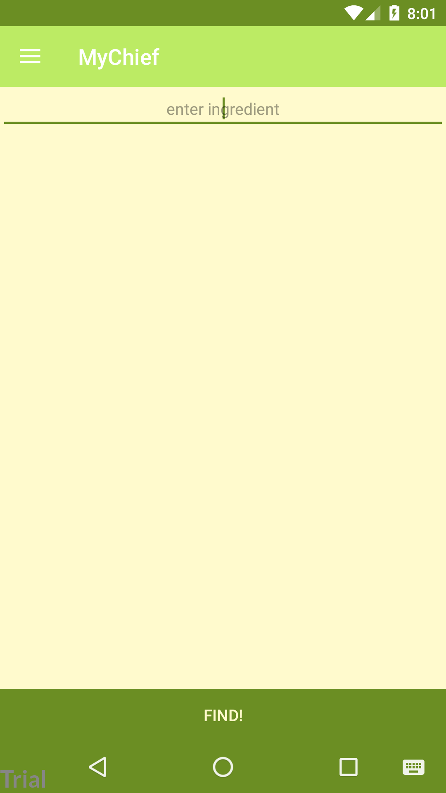
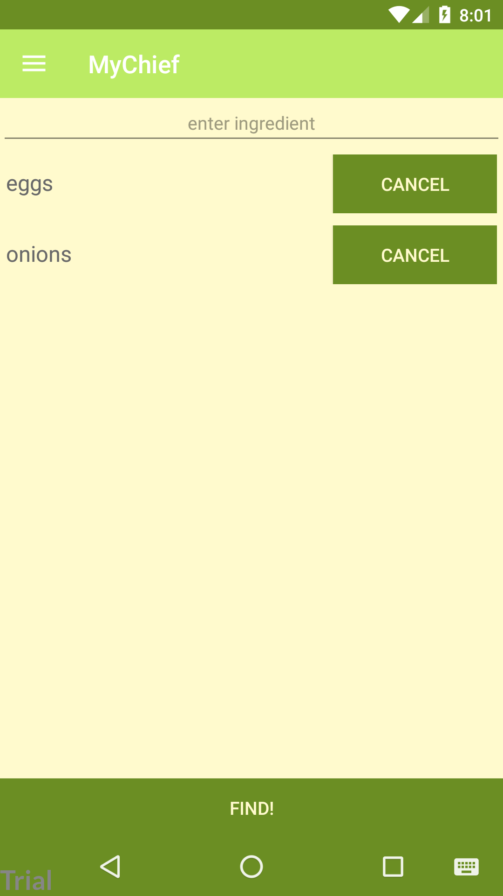
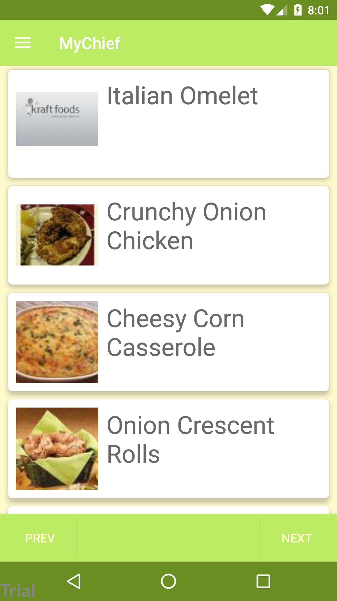
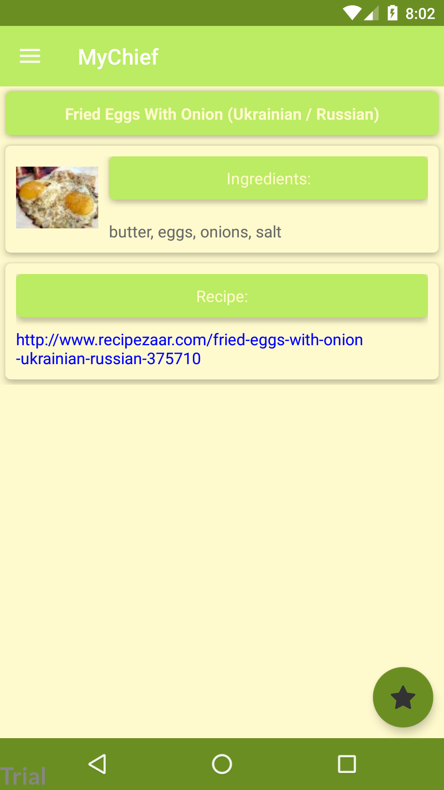
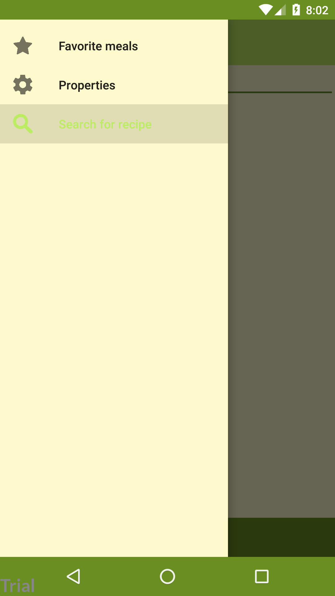
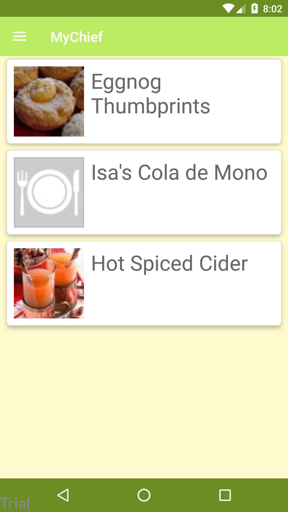

<h1 align="center"> MyChief </h1>
<h3 align="center">This application will help you to decide what meal you could cook by products, you have</h3>
 
<h4 align="center">This screenshots shows the estimated and basic logic of our application (that functions we have now)</h3>

<h4 align="center">First you have to chose the products, you have</h4>

  

 

<h4 align="center"></h4>

  

 

<h4 align="center">Then the application shows you the meals, you could cook</h4>

  

<h4 align="center">Just choose the meal, and read a recipe</h4>

  

<h4 align="center">You can add meals to favourites</h4>

  

  

 
 
<h3>This is a training application, our aim is learn more about Android developing</h3>
<h4>We use a public APIs: "Recipe Puppy API", GSON, OKHttp etc</h4>
